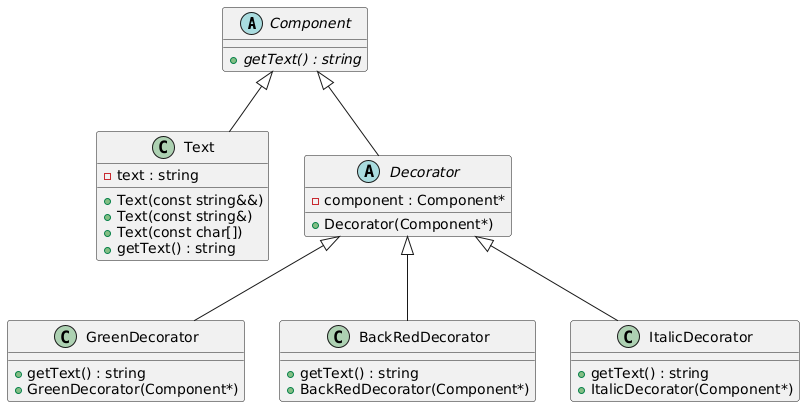

# Домашнее задание по теме "**Структурные паттерны. Паттерн Decorator**"

В файле `main.cpp` представлен пример работы с декораторами.

Существующие классы:

- `Component` - абстрактный *компонент* системы, который поддерживает печать в стандартный поток вывода `std::cout`
- `Text` - обычный текст
- `Decorator` - абстрактный декоратор текста
- `GreenDecorator` - декоратор, добавляющий зелёный шрифт
- `BackRedDecorator` - декоратор, добавляющий к тексту зелёный фон
- `ItalicDecorator` - декоратор, делающий текст курсивным

## Что нужно сделать:

1. **Создайте тип** `enum` со стандартными цветами используемыми в консоли
2. **Вместо** классов `GreenDecorator` и `BackRedDecorator` создайте 2 универсальных класса `ColorDecorator` и `BackColorDecorator` для цвета шрифта и фона соответственно. Вторым аргументов в конструкторах у них должен быть цвет.
3. Вынесите все классы (*уже существующие и созданные*) в отдельные файлы `*.cpp` и `*.h`.
4. Измените примеры в файле `main.py` так, чтобы они **демонстрировали** работу созданных Вами классов.
